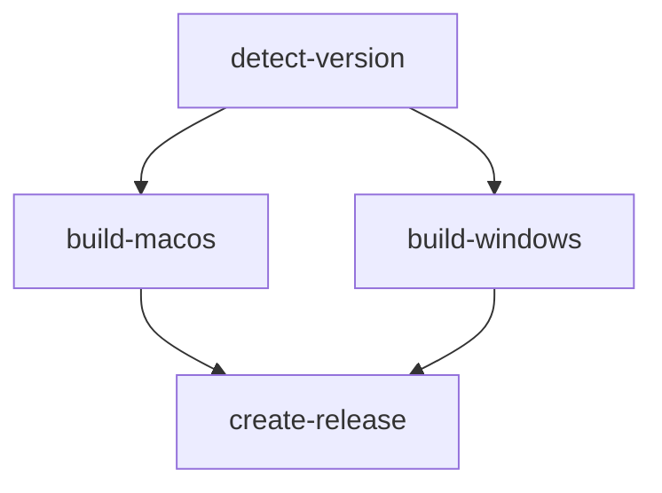

# GitHub Actions Workflows

This directory contains GitHub Actions workflows for building and releasing FPV Trackside Core across multiple platforms.

## 🚀 Workflows Overview

### 1. `build-and-release.yml` - Automatic Build & Release
**Triggers:**
- Push to `master` or `main` branch
- New tags starting with `v*`
- Manual dispatch with release option

**What it does:**
- Automatically detects version numbers from project files
- Builds both macOS (Apple Silicon) and Windows (x64) versions
- Creates app bundles with proper structure
- Automatically creates GitHub releases with generated release notes
- Uses semantic versioning for release tags

### 2. `build-test.yml` - Pull Request Testing
**Triggers:**
- Pull requests to `master` or `main`
- Manual dispatch

**What it does:**
- Tests building both platforms in Debug and Release modes
- Runs code formatting checks
- Quick validation without creating releases
- Faster feedback for development

### 3. `manual-release.yml` - Manual Release Creation
**Triggers:**
- Manual dispatch only

**What it does:**
- Allows custom release tags and titles
- Supports custom release notes
- Option to mark as pre-release
- Full control over release timing and content

## 📋 Version Detection

The workflows automatically extract version numbers from:
- **macOS**: `FPVMacSideCore/FPVMacsideCore.csproj` → `<Version>2.0.42.3</Version>`
- **Windows**: `FPVTracksideCore/FPVTracksideCore.csproj` → `<Version>2.0.69.1</Version>`

## 🏗️ Build Outputs

### macOS
- **Target**: Apple Silicon (ARM64) with universal compatibility
- **Output**: Self-contained app bundle in ZIP archive
- **Structure**: Proper `.app` bundle with Info.plist
- **Naming**: `FPV-Trackside-Core-macOS-v{version}.zip`

### Windows
- **Target**: Windows x64
- **Output**: Self-contained executable in ZIP archive  
- **Includes**: All dependencies and FFmpeg binaries
- **Naming**: `FPV-Trackside-Core-Windows-v{version}.zip`

## 🎯 Usage Instructions

### Automatic Releases
1. **Push to main branch**: Triggers build and auto-release
2. **Create git tag**: Push with `git tag v1.2.3 && git push origin v1.2.3`
3. **Version bump**: Update version in project files and push

### Manual Releases
1. Go to GitHub Actions tab
2. Select "Manual Release" workflow
3. Click "Run workflow"
4. Fill in:
   - **Release tag**: `v2.0.42.4` (must follow semantic versioning)
   - **Release title**: Optional custom title
   - **Release notes**: Optional additional notes
   - **Pre-release**: Check if this is a beta/preview

### Testing Pull Requests
- Automatically runs on all PRs
- Check build status before merging
- Validates both platforms compile correctly

## 🔧 Configuration

### Required Repository Settings
1. **Actions permissions**: Allow GitHub Actions to create releases
2. **GITHUB_TOKEN**: Automatically provided (no setup needed)

### Optional Customizations
- Modify `.NET` version in `env.DOTNET_VERSION`
- Change target frameworks in build commands
- Adjust artifact retention days (currently 90 days)
- Customize release note templates

## 📦 Artifacts

All workflows upload build artifacts that can be downloaded from the Actions tab:
- **Retention**: 90 days
- **Access**: Available to repository collaborators
- **Auto-cleanup**: Artifacts are automatically deleted after retention period

## 🐛 Troubleshooting

### Common Issues

**Build fails on macOS:**
- Check .NET 6.0 compatibility
- Verify project references are correct
- Ensure FFmpeg binaries are present

**Build fails on Windows:**
- Check Windows-specific dependencies
- Verify DirectX/MonoGame references
- Check file path lengths (Windows limitation)

**Release creation fails:**
- Ensure repository has proper permissions
- Check if tag already exists
- Verify GITHUB_TOKEN has write access

**Version detection fails:**
- Ensure `<Version>` tags are properly formatted in `.csproj` files
- Check for XML parsing issues
- Verify file paths in workflow

### Debug Tips
1. Check workflow logs in GitHub Actions tab
2. Look for red X marks indicating failed steps
3. Download and test artifacts manually
4. Compare successful runs with failed ones

## 🔄 Workflow Dependencies

Each workflow is designed to be independent and can be run separately as needed.