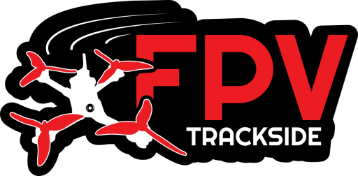
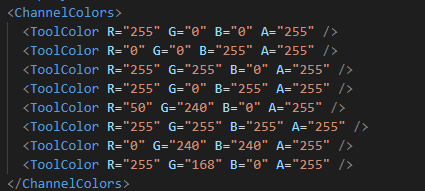
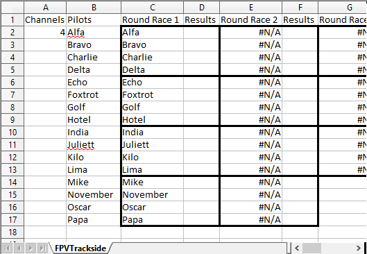
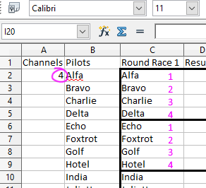
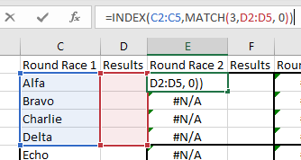

## Table of Contents

- [Getting started](#getting-started)
  - [Event Selection](#event-selection)
    - [Event Name](#event-name)
    - [Laps](#laps)
    - [PB Laps](#pb-laps)
    - [Race Length](#race-length)
    - [Min Start Delay / Max Start Delay](#min-start-delay-max-start-delay)
    - [Race Start Seconds to Ignore Detections](#race-start-seconds-to-ignore-detections)
    - [Primary Timing System Location](#primary-timing-system-location)
      - [End of Lap](#end-of-lap)
      - [Holeshot](#holeshot)
    - [Smart Minimum lap time](#smart-minimum-lap-time)
- [Main Screen](#main-screen)
  - [Quick functions](#quick-functions)
  - [Timing Settings](#timing-settings)
    - [Adding a Timing System](#adding-a-timing-system)
    - [RotorHazard](#rotorhazard)
    - [Lap RF 8 way](#lap-rf-8-way)
    - [Lap RF Puck](#lap-rf-puck)
    - [Delta 5 / ZippyD](#delta-5-zippyd)
    - [Dummy](#dummy)
    - [Multiple Timing Systems](#multiple-timing-systems)
  - [Video Settings](#video-settings)
    - [Channel Mapper / Video test](#channel-mapper-video-test)
      - [No Channel](#no-channel)
      - [Channel Assignment](#channel-assignment)
      - [Camera](#camera)
        - [Commentators](#commentators)
        - [Launch](#launch)
        - [Finish Line](#finish-line)
        - [PhotoBooth](#photobooth)
    - [Any USB Port](#any-usb-port)
    - [Video Mode](#video-mode)
    - [Flipped / Mirrored](#flipped-mirrored)
    - [Stop feed when not in use](#stop-feed-when-not-in-use)
    - [Channel Splits](#channel-splits)
    - [Channel Crop Percent](#channel-crop-percent)
    - [Overlay](#overlay)
    - [Supported video devices](#supported-video-devices)
    - [OBS Virtual Camera Plugin](#obs-virtual-camera-plugin)
    - [RTMP Input](#rtmp-input)
  - [Theme Settings](#theme-settings)
  - [Custom Themes](#custom-themes)
    - [Image-based Theming](#image-based-theming)
      - [File structure](#file-structure)
      - [How colours are read](#how-colours-are-read)
      - [Customising a theme](#customising-a-theme)
    - [Theme.xml](#themexml)
    - [Channel Colors](#channel-colors)
  - [General Settings](#general-settings)
  - [Profile Settings](#profile-settings)
  - [Scenes](#scenes)
  - [Channels](#channels)
    - [Channel Groups](#channel-groups)
    - [Analog / HDZero / DJI](#analog-hdzero-dji)
  - [Managing Pilots](#managing-pilots)
    - [Adding pilots](#adding-pilots)
    - [Removing pilots](#removing-pilots)
    - [Recovering removed pilots](#recovering-removed-pilots)
    - [Changing Channels](#changing-channels)
  - [Running Races](#running-races)
    - [Adding pilots to the race](#adding-pilots-to-the-race)
    - [Round / Race Types](#round-race-types)
      - [Race](#race)
      - [Endurance / Aggregate Laps](#endurance-aggregate-laps)
      - [TimeTrial](#timetrial)
      - [Practice](#practice)
      - [Casual Practice](#casual-practice)
      - [Freestyle](#freestyle)
    - [Starting the race](#starting-the-race)
    - [Stopping the race](#stopping-the-race)
    - [Clearing pilots](#clearing-pilots)
    - [Copying Results](#copying-results)
    - [Reset race](#reset-race)
    - [Resume race](#resume-race)
  - [Auto Runner](#auto-runner)
    - [Auto Runner — Timing](#auto-runner-timing)
    - [Auto Runner — Video Check](#auto-runner-video-check)
    - [Auto Runner — Sound](#auto-runner-sound)
    - [Auto Runner — Rounds](#auto-runner-rounds)
  - [Lap Editing](#lap-editing)
    - [How laps / detections work.](#how-laps-detections-work)
    - [Disqualifying lap(s)](#disqualifying-laps)
    - [Splitting laps](#splitting-laps)
    - [Adding laps](#adding-laps)
    - [Editing laps / Undisqualifying laps](#editing-laps-undisqualifying-laps)
  - [Replay / Video recording](#replay-video-recording)
    - [Shortcut Keys](#shortcut-keys)
    - [Editing Laps](#editing-laps)
  - [Round Generation](#round-generation)
    - [Generating rounds](#generating-rounds)
      - [Randomise, Keep Channels](#randomise-keep-channels)
      - [Randomise](#randomise)
      - [Clone](#clone)
      - [Final](#final)
      - [Double Elimination](#double-elimination)
      - [Show Points](#show-points)
      - [Show PBs](#show-pbs)
      - [Top 16 / Top 32 / Top X](#top-16-top-32-top-x)
        - [Ordered Top X](#ordered-top-x)
        - [Seeded Top X](#seeded-top-x)
    - [Round Types](#round-types)
    - [Removing rounds](#removing-rounds)
    - [Auto fill round](#auto-fill-round)
    - [Pasting in a round](#pasting-in-a-round)
    - [Re-ordering rounds](#re-ordering-rounds)
    - [Opening a race](#opening-a-race)
    - [Deleting a race](#deleting-a-race)
    - [Moving pilots around](#moving-pilots-around)
    - [Brackets / Divisions](#brackets-divisions)
  - [Custom Round Generation](#custom-round-generation)
    - [Lua Scripting](#lua-scripting)
      - [Getting Started](#getting-started)
      - [How a Script Works](#how-a-script-works)
      - [Built-in Helper Functions](#built-in-helper-functions)
      - [Brackets and Race Options](#brackets-and-race-options)
      - [Full Documentation](#full-documentation)
  - [Spreadsheet based formats](#spreadsheet-based-formats)
    - [Spreadsheet Setup](#spreadsheet-setup)
      - [Sheet details](#sheet-details)
        - [Channels](#channels)
        - [Lock Channels](#lock-channels)
      - [Pilots](#pilots)
      - [Round {X} {Y}](#round-x-y)
      - [Result](#result)
      - [Lookup results and do things with those results](#lookup-results-and-do-things-with-those-results)
- [Race data synchronisation with web services](#race-data-synchronisation-with-web-services)
- [FPVTrackside.com](#fpvtracksidecom)
  - [Patreon](#patreon)
  - [Club Setup](#club-setup)
  - [Syncing Results](#syncing-results)
- [MultiGP](#multigp)
  - [API Key](#api-key)
  - [Synchronising Down Events](#synchronising-down-events)
  - [ZippyQ / Schedule](#zippyq-schedule)
  - [Synchronising Up Results](#synchronising-up-results)
  - [Channel Mapping](#channel-mapping)
  - [GQ - Global Qualifier](#gq-global-qualifier)
- [Streaming and OBS Setup](#streaming-and-obs-setup)
- [OBS Remote Control](#obs-remote-control)
  - [Setup](#setup)
  - [Triggers and Actions](#triggers-and-actions)
- [Local Web Server](#local-web-server)
- [Gate / LED Notifications](#gate-led-notifications)
- [Performance](#performance)
- [Data and config](#data-and-config)
  - [Logs](#logs)
  - [Data](#data)
- [Shortcut keys](#shortcut-keys)
- [Recommended Setup](#recommended-setup)
  - [Hardware](#hardware)
  - [Layout diagram](#layout-diagram)
- [Open Source](#open-source)

---


# Getting started


## Event Selection

An event is basically a collection of pilots, races and settings that make up a particular race day. The first time an event is created for you with some default parameters. After that you’ll use the buttons towards the bottom of the page to make new events / remove events / clone events.


### Event Name

Names the event so you can find it later. Also when the software is running it shows up in the top left to the screen so name it something appropriate.


### Laps

In a Race it specifies the end of the race, in TimeTrial it specifies the number of consecutive laps that pilots will be timed.


### PB Laps

The PB stands for Personal Best. This is a timed consecutive lap count that will show up on the top of a racers screen. In a race you’d typically leave it as 1 lap so that each pilot's best lap time is shown. In time-trial you’d likely match it to the Laps setting so their best consecutive laps are shown. When a new PB has been made in this race it will come up in Green lettering. When a pilot has the best PB of any pilot it will be Purple.


### Race Length

At the end of this timer the announcer will call the pilots to finish their laps and land. Each pilot can only record 1 lap after the timer and the rest will be marked invalid. They can be made valid from the lap editor.


### Min Start Delay / Max Start Delay

At the start of the race the announcer will call “Arm your quads, starting on the tone in under X” where X is the Max Start Delay. Then a random amount of time less than Max Start Delay will be waited and the race will begin. Additionally there is the Min Start Delay setting which is the minimum time to wait so that there is always a pause between the end of the announcement and the race start.


### Race Start Seconds to Ignore Detections

This is the amount of time after the start of the race to ignore any detections. Some track layouts have the pilots start near the timing system, you can use this to make sure they don’t false trigger at the start of a race. The times are recorded just marked as invalid in the system. They can be made valid from the lap editor.


### Primary Timing System Location

This setting has 2 possible options and needs some explanation. It tells the timing system about your track layout.


#### End of Lap

The first time the pilots fly through the timing gate marks the End of the first lap. Use this option if your track starts and doesn’t immediately go through the timing system.


#### Holeshot

The first time the pilots fly through the timing gate marks the Start of the first lap. Use this option if your track starts and the pilots fly through the timed gate right away. This first detection will give the system a Holeshot time and is ideal for TimeTrials as the pilots don’t waste time doing an uncounted first lap.


### Smart Minimum lap time

If a lap is under this time it will be marked as invalid and not shown on screen or called out. This is handy when your timing system is getting lots of impossibly short laptime false reads. However because each lap is made out of 2 detections we have to determine which detection was the false read. To do that we actually wait for the next detection so we can work out which detection is more likely the false one by comparing lap time averages.


So the main things to be aware of

- Delayed. It only invalidates after the next lap.
- It only removes the clear false reads.
- It can’t invalidate the last lap or change final positioning.
- Leaves big decisions to the Race Director

# Main Screen

Once you’ve set up your event and pressed Ok you’ll be brought to the main screen which is laid out as follows..

- Pilot list on the left. All pilots in this event are shown here. Right click it to add pilots. The pilot list will hide itself during races to maximise the size of the FPV feeds.
- Event and Race info at the top. Many of these items are clickable for quick changes. For example laps or race type.
- Tabs are also shown across the top. Allowing you to choose what to display in the main area of the screen.
- Race controls and settings are on the right hand side. The main way to access the settings of the following options is the settings button near the top right of the screen. It looks like 3 horizontal lines.

## Quick functions

Here are some handy functions you can do on the main screen to speed up configuration.

- Drag and drop pilots from the pilot list to races in the Rounds Tab.
- Drag pilots onto the Live tab to add them to the current race.
- On the live tab drag a pilot onto a different pilot to swap their channels.
- Right click on UI elements to see other options
- Hold Control when clicking a lap to quickly disqualify it.
- Click the top Event Type button (race, timetrial etc) to quickly change the type of the current race.
- Click the Laps at the top of the screen to quickly change how many laps we’re targeting.

## Timing Settings

Timing system settings are available from the Settings button in the top right of the screen.We currently support using RotorHazard and LapRF systems.


The easiest way to get started is by purchasing a system from our friends who provided our development hardware at Nuclear Quads. Which is a very nice implementation of the RotorHazard system.
https://nuclearquads.github.io/


### Adding a Timing System

Press the Add button to the bottom of the page to pop up a list of the various timing systems the software supports.


Both of the main timing systems primarily connect via a network interface. The easiest way to do this is to set your timer and your laptop to DHCP and have a wifi access point that allocates both devices an ip address. Then you can use the “Scan Network” button at the bottom of the timer settings window and FPVTrackside will automatically discover any timers on the network.


If you’re using a cable directly between the timer and your PC you’ll need to manually set a static IP on both your timer and your PC. They’ll need to be within the same ip address range so setting your PC to 192.168.1.4 and your timer to 192.168.1.9 would be a good fit.


### RotorHazard

You’ll need to put the IP into hostname. A port of 5000 is good unless you’ve changed the default port in your RH settings.


If you’re using a recent version of RH you should turn on Sync Pilot Names so that the RH marshalling system can be aware of which pilot is flying.


### Lap RF 8 way

The Lap RF defaults to an ip of 192.168.1.9. So trackside comes configured to connect to that ip by default.


### Lap RF Puck

The puck is a little trickier to get going. For whatever reason the puck ships in a communication mode that is incompatible with its own libraries. So to switch its USB mode you need to use a terminal program (like Putty) to connect to it via the com port and type the command Upp and press enter. Just Capital U then 2 p’s and enter.


After that give it a full reboot and it should now be in binary mode. If you’re having any problem check out my biggest competitors youtube video on the subject https://www.youtube.com/watch?v=14CA9nAUJSw


After that it’s just a matter of selecting LapRF Puck USB and using the drop down list to select its com port. It should connect and behave just like its bigger brother, just less accurately.


### Delta 5 / ZippyD

We no longer support the Delta 5 system. However there is a software upgrade path to RotorHazard which we do support and is still being actively developed.


### Dummy

A little random number generator. Can be configured to spit out random times so that you can debug your OBS feed and layouts with realish looking data.


### Multiple Timing Systems

FPVTrackside supports having multiple timing systems. The way it works is there will be one main timing system that does each Lap, then as many additional split timing systems as you want to put on your track. Pilots are not required to have triggers on the split timers, if a split timing system misses a trigger, the lap will count as normal.


When using multiple timing systems just press Add to add as many as you require. The list on the left will show you in brackets what function each timing system is performing. They can be dragged around to position them in the right spots.


## Video Settings

FPVTrackside is all about video. ‘Video settings’ is accessible from the Settings button on the main screen. Video to channel mapping is done on a left to right top to bottom order. Add an additional “device” by using the add button at the bottom and then configuring the following properties.


### Channel Mapper / Video test

The top of the input screen shows the video feed coming in directly from the device. The config set below will dynamically update and show in this little area.


Clicking on a section of the area will give you some options..


#### No Channel

Un-assigns this video feed. It won’t be used in FPVTrackside


#### Channel Assignment

Assigns the selected channel to this feed. When a pilot flies on this channel, this feed will be shown.


#### Camera

Assign this feed to one of the following camera types


##### Commentators

Point at you the race director. You’re famous! Can be configured to show during the race.


##### Launch

Point this at the starting blocks. Will take up the top ⅔ of the screen pre race start and then animate away after a few seconds.


##### Finish Line

Similar in visual style to Launch but activates on a button press (see the key mapper) at the end of the race. Handy for turning on a highspeed camera for recording an epic finish.


##### PhotoBooth

For taking photos / clips of pilots to show on the pre-race scene.


### Any USB Port

If this is selected FPVTrackside will attempt to always find the video capture device based on its name rather than which USB port it’s plugged into. It’s handy on race day when you’re in a rush to get everything plugged in. However if you have multiple video input devices with the same name you’ll definitely want to turn this off.


### Video Mode

The Framework, resolution, frame rate and color space of the video input. These can affect performance. Modes using Media Foundation will generally run significantly better than the older DirectShow framework. Especially when recording.


### Flipped / Mirrored

Some devices are inverted / mirrored or you physically have to mount them upside down. Use this to fix it.


### Stop feed when not in use

This tells the video device to stop sending video data when it’s not being shown on screen. This saves a lot of processing power when you have a lot of input devices and generally should be left on. However some devices take a few seconds to get going again after they’ve been stopped. So turn this off if you’re getting annoying delays.


### Channel Splits

Generally the video sources used by FPVTrackside come via a security system that divides the pilots video feeds up into sections of the screen. This is the setting you’d configure to match your security system. For example, if you security system outputs 9 sub video feeds in a 3x3 grid you would select three by three. For a security system with 4 outputs, you’d choose two by two. Or if each pilot gets their own video feed just choose Single Channel.


### Channel Crop Percent

Sometimes security system feeds bleed into each other slightly. This setting lets you slightly shrink each pilots video feed to crop out any bleed from the other pilots feed or the security systems interface. It’s a percentage that shrinks towards the middle of the feed as you lower the number. Default value is 99%.


### Overlay

For the non-fpv source types a text description will be added to the screen in the specified position. It can also be disabled and renamed. This is now done on the main FPVTrackside screen. Right click on the camera feed you want to change and you’ll see the overlay options.


### Supported video devices

FPVTrackside should work with most DirectShow or Media Foundation compatible capture devices. Including modern Elgatos, webcams and those little $15 thumbstick capture devices bought on ebay. Incompatible devices however can always be used via OBS Virtual Camera which I go into further a bit later.


Generally avoid expensive higher-end devices. They generally have hardware encoders that add significant latency as well as reduce performance in FPVTrackside as it then has to decode the encoded footage to then draw it.


### OBS Virtual Camera Plugin

This lets you run OBS as an input into FPVTrackside. This means you can effectively use any device / program that is OBS compatible. It works with all the cropping and scaling in OBS so you can really do some rather advanced things with it.

To enable it in OBS, go to Tools → VirtualCam and press Start. In FPVTrackside's Video Settings, add a new video source and choose "OBS Virtual Camera" from the device list. It will appear as a standard capture device.


To also stream, you’ll need to run a second OBS instance capturing the FPVTrackside window as normal.


### RTMP Input

FPVTrackside can receive an RTMP video stream as a video input source. This lets OBS (or any software that supports RTMP output) push video directly into FPVTrackside without needing a physical capture device.

To set up RTMP input, add a new video source in Video Settings and choose RTMP as the device type. There are two modes:

Listen mode (default) — FPVTrackside acts as an RTMP server and waits for a stream to be pushed to it. Set the URL to rtmp://localhost/live and configure OBS to stream to the same address. This is the recommended approach for a single-machine setup.

Connect mode — FPVTrackside connects out to an existing RTMP server. Enter the full RTMP URL of the remote server as the URL.

Choose a resolution and frame rate in Video Mode to match your OBS output settings. Supported resolutions are 480p, 720p, 1080p, and 4K at 30fps or 60fps.

If the stream disconnects, FPVTrackside will hold the last received frame and automatically reconnect when the stream resumes.

To stream to an external service such as YouTube or Twitch at the same time, run a second OBS instance capturing the FPVTrackside window as described above.


## Theme Settings

The visual theme of the software can be chosen in Theme Settings. There are a number of defaults you can choose from on the left and a small example on the right. Press Set Theme to apply it.


## Custom Themes

Themes are stored in the themes directory. Each theme will have its own directory with the name of the theme.


Inside the theme there are a number of images and also the theme.xml that contains all of the colour/texture data. The images can be modified with club logos etc.


The default included themes will be overwritten when a new version is installed. So before customizing a theme, copy and rename one of the directories. Name it the name of your new theme. When you restart trackside it will be there.


### Image-based Theming

Newer themes use an image-based system that is easier to edit visually. Instead of setting raw RGBA values in XML, colours and textures are read directly from a PNG image file so you can use any image editor to customise the look.


#### File structure

An image-based theme folder contains two key files alongside the usual textures:

theme.png — A 2048x2048 PNG image that acts as a combined colour palette and texture atlas. Every colour and panel texture used by the UI is defined by a region of this image.

theme2.xml — Maps each UI element to a pixel coordinate or rectangular region inside theme.png. You generally do not need to edit this file unless you want to restructure the layout of the image itself.


#### How colours are read

Each UI element in theme2.xml is defined as either a TextureColor or a TextureRegion:

TextureColor — a single pixel at a given (X, Y) coordinate in theme.png. The colour of that pixel becomes the colour of the UI element (e.g. text colour, scrollbar colour).

TextureRegion — a rectangular area defined by (X, Y, Width, Height). The pixel at the centre of that rectangle is sampled for the element's colour, and the rectangle itself is used as the texture for panel backgrounds.


#### Customising a theme

Open theme.png in any image editor (Photoshop, GIMP, Paint.NET, etc.). Paint new colours at the pixel positions defined in theme2.xml, or repaint panel regions to change background textures. Save the file and restart FPVTrackside to see the changes.

To find out which pixel controls which element, open theme2.xml and look up the element name — the X and Y values tell you exactly where to paint in theme.png.

As with the old system, copy the theme folder to a new name before editing so your changes are not overwritten when a new version of FPVTrackside is installed.


### Theme.xml

UI elements are grouped together in themes. Below I have an example from themes for the Editor. Which is the UI element you use to edit settings, events, laps and races.


```xml
 <Editor>
   <Border R="23" G="15" B="25" A="185" />
   <Background R="30" G="22" B="32" A="185" TextureFilename="" />
   <Foreground R="35" G="27" B="37" A="185" TextureFilename="" />
   <Text R="255" G="255" B="255" A="255" />
 </Editor>
```

Each line contains the 4 attributes needed to assign a colour. Red, Green, Blue and Alpha (Transparency). All values are in the common 0 - 255 scale with 0 being darkest and 255 being full colour. For Alpha, 0 is invisible and 255 fully visible.


Many elements also include the “TextureFilename” option which will override the color set if a matching image is found with the given name. Basically, it lets you set the background of various panels to an image. The image will be stretched and scaled to fit the given panel, so make sure it’s shaped to match.


### Channel Colors



- These are also stored in the Theme xml file.
- They’re stored in frequency order. So the lowest frequency channel will have the first color. Second lowest, second color etc.
- Channels grouped together that share a common frequency will share the same color.


## General Settings

General settings are where we store settings that are generally specific to the computer FPVTrackside is installed on. So the directory where we store the event / video files are configured here. As well as a few performance options.


## Profile Settings

Profiles settings contains most of the general purpose configuration settings you’re likely to want to change. Very similar to General settings, however they are also configurable with profiles.

The idea is as a race directors you may run different “types” of events or re-use the same setup at multiple clubs. For example. You may run a Whoop night with a specific setup, and then a 5inch race day with a different setup. You can set these up as multiple Profiles on the Event Selection screen and then switch between these setups.


## Scenes

FPVTrackside has 3 scenes that automatically change based on Race state and show the various input video feeds.

- Pre Race - Launch cam, commentator cam, pit cams
- Race - The normal FPV feeds
- Post Race - Results, commentator cam, next race

Scenes work really well when combined with the Round generation system which you can read about later in the document. Once you have rounds setup you can move through to the next race directly from the post race scene. You can effectively run the entire event just by clicking the next race.


Both Pre race and Post race can be disabled in General Settings. Pre-race will also be effectively disabled if you have no extra video inputs.


## Channels

Channels are editable from the Settings button. It defaults to IMD6c. More channels can be Added with the Add button.


Each event has its own set of channels. A set of channels can be saved as a new event’s default using the checkbox in the bottom left of the Channel Settings screen.


### Channel Groups

If you add multiple channels on the same frequency (for example HDZero 1 and Raceband 1) it will automatically group these channels together and combine them as one slot in the Rounds screen. This is handy when managing digital as detailed below…


### Analog / HDZero / DJI

FPVTrackside is aware that these channels are incompatible. A pilot on Digital DJI 1 can’t simply swap to Analog Raceband 8. So when adding pilots to races the software will only add pilots when there is a compatible free slot.


This is particularly handy when combined with Channel Groups if you add a pilot to a slot with both a Digital and an Analog channel. When added, the pilot will automatically be added to the appropriate type based on their past race, or the channel they’re set to in the left hand pilot list.


To correct any changes or mis-assignments; Right clicking on the pilot in the race will bring up a channel change menu.


## Managing Pilots


### Adding pilots

The pilot list is on the left hand side of the screen. Right clicking on it will bring up a menu to Add, Edit or import the pilots.

- To add one pilot just click add pilot and type their name in the popup window.
- To import an event's worth of pilots go to your spreadsheet and select all your pilot names and press copy, then in trackside press the “Import from clipboard” menu item. The pilots will be shown to you in the pilot editor window, to finish the import press save.
Pilots are shared between events based on their lowercase pilot name. So when you add a pilot that has been in one of your events before the same pilot in the database will be added to this new event. Eventually the software will have per-pilots statistics across multiple events.


### Removing pilots

To just remove one pilot right click on the pilots list and press remove. Pilots will not be deleted they will just be removed from this event.


### Recovering removed pilots

Right click on the pilot list and press recover to bring back all the previously removed pilots.


### Changing Channels

You can change the channel of each pilot by clicking on the channel next to their name. Right clicking the pilot list in general will give you the option to redistribute the pilots evenly across all channels.


## Running Races


### Adding pilots to the race

There are 3 ways to add pilots to a race..

- Round Generation - Use the round generator to create rounds for you. Then from the rounds screen simply click the race you want to run. There is a section on this later in the manual.
- Manual - Click the pilots name in the pilots list on the left. If their channel is free they will be added to the race. If their channel is not free, you can force-add the pilot by holding ctrl. The next free channel will be used by the pilot.
- Import from the clipboard - If you have a spreadsheet to manage your race day you can copy the cells with the pilot names in your spreadsheet, then in FPVTrackside press ctrl-V to paste in the pilots. There is also a button to do this on the right. It looks like a clipboard going into 6 pilot windows.

### Round / Race Types

Each race in a round shares the same type. They define the rules of each race.


#### Race

The pilots race to complete the specified number of laps. The announcer will call out the pilot's position at the end of each lap. At the end of the race the result screen will show pilots positions within this race.


#### Endurance / Aggregate Laps

Pilots try to complete the most laps in a specified time. If pilots complete the same number of laps then the winner is whoever completed them faster.


#### TimeTrial

The pilots compete on consecutive lap times. However, the pilots can and will do more than the specified laps and the best of those consecutive laps are chosen. The announcer will call out consecutive lap times once the pilot has done the required number of laps. At the end of the time trial when the race director presses stop the results screen will show each pilot's best laps and their current position within the entire event.


#### Practice

Very similar to the time trial in format however none of the times are ever counted towards results. Basically a time trial that doesn’t count.


#### Casual Practice

Laps on all frequencies are recorded and there is no time limit. Pilots will be automatically created with names based on the channel and race/round number, R1 (1-1) for example. This mode is great if you just have a bunch of people who just want to plonk down their drone and fly.


#### Freestyle

Timing system is disabled, lap related parts of the UI are hidden and the video feed is shown front and center. The only active thing are the timers for Race Length.


### Starting the race

Once you have pilots added to the race with their video feeds showing you’re ready to start the race. A Play icon will appear on the right of the screen. Press it and the announcer will begin starting the race.

If something has gone wrong in the software or in the timing system the announcer may cancel the race start. Check your cabling / settings and try again.


### Stopping the race

Once the start race button has been pressed the buttons a new stop button appears. Pressing the stop button immediately ends the race. Stops detection. And the announce calls it out.


If stop is pressed during the pre-start, before the start tone, the announcer will tell pilots to disarm and the race will not begin.


### Clearing pilots

- Once pilots have been added to the race a new button appears that Clears all the current pilots in a race. It looks like a dusting brush. It can only be pressed before a race begins, or after it is finished.
- Once a race has finished it must be pressed to clear the screen ready to run the next race.

### Copying Results

Once a race has been completed, a new button appears that looks like a podium going into a clipboard. Pressing this will copy the results of the current race into the clipboard so you can paste it back into any spreadsheet you are using to run the event. There are several export options in General Settings to configure which columns you want.


### Reset race

Another icon that appears after a race has finished is the reset button. It looks like an arrow going back on itself. Pressing it will clear the race results and reset the race back to the start so you can do a rerun. There is a confirmation popup so you don’t accidentally do it.


### Resume race

- After a race has ended, it can be resumed to continue the race where it left off.
- If the race ended within the last 5 seconds, this will happen silently as it’s assumed the race stoppage was a mistake.
- If the race end was over 5 seconds ago, it will be restarted with the normal ‘less than five’ voice and the horn. This is handy for endurance races.

## Auto Runner

The Auto Runner automates the flow between races so the event can run hands-free. When active it handles transitioning from results to the next race, optionally checks that all pilots have a live video feed before starting, and can even generate new rounds automatically when all scheduled races are complete.

The Auto Runner is configured from the Auto Runner settings panel in Profile Settings. It starts paused — press the pause/resume button on the main screen to activate it.


### Auto Runner — Timing

- Seconds to show results — How long to display race results before automatically loading the next race. Default 60 seconds.
- Seconds to next race — How long to wait on the pre-race scene before automatically starting the race. Default 300 seconds (5 minutes).
- Seconds to finish lap after timer runs out — Extra time allowed for pilots to finish their final lap once the race timer expires. Default 10 seconds.

### Auto Runner — Video Check

Check pilots video — When enabled, the Auto Runner will verify that all pilots in the upcoming race have a live (non-static) video feed before starting. If a static feed is detected it will announce the delay and wait. Default enabled.

Seconds delay if static — How long to wait before trying to start again after a static video feed is detected. Default 90 seconds.

This feature requires the Video Static Detector to also be enabled in Profile Settings.


### Auto Runner — Sound

Announce next race in — When enabled, the announcer will call out the time remaining until the next race starts at configurable intervals. Default disabled.

Next race in announce seconds — The countdown points (in seconds) at which the announcer will call the time remaining. For example [10, 30, 60, 120] will announce at 2 minutes, 1 minute, 30 seconds and 10 seconds to go.


### Auto Runner — Rounds

- Auto create rounds — When enabled and all races in the current round are complete, a new round will be generated automatically. Default disabled.
- Auto create rounds type — How the new round is generated:
- Keep Channels — Pilots keep their current channels but are shuffled into new race groupings.
- Random Channels — Pilots are reassigned to new channels and shuffled.
- Clone Last — The previous round is duplicated exactly.

## Lap Editing


### How laps / detections work.

- Each detection is a single point in time. To make a lap, we need 2 points in time, the start detection and the end detection.
- In the software a lap is created when we have an end detection. With the start being worked out from the start of the race or the detection of the previous lap.

When you disqualify a lap, its detection will be removed and it will also no longer be the start detection of the following lap. This means when a lap is disqualified, the lap after the disqualified lap will become longer.

Basically, when you disqualify a lap, you are really disqualifying a “detection”. The laps shuffle around their times to fit whatever detections are left. So when disqualifying laps, try not to look at the lap times, try to work out which detections are invalid by asking pilots/spotters/video what occurred. Often a small lap time means the previous lap detection is wrong, not the one with the tiny time.


### Disqualifying lap(s)

While a race is running the most typical problem you’ll get is an extra lap detection. Right click on the lap and press Disqualify to remove that lap. As a faster method, you can also hold Ctrl and left click that lap to disqualify it.


### Splitting laps

If a detection has been missed by the timing system, but the lap after the missed detection was correctly detected. You can split the longer lap into 2 laps with half the original time in each. To do this right click the lap and select Split into 2.


### Adding laps

Another solution to a missed lap is simply adding a lap at the current time. To do that right click on the lap bar and select add. In a race this can be helpful as it will often give you correct position information. However at the end of the race it will be worth going through and editing the laps otherwise the manual add will often give the pilot new record times.


### Editing laps / Undisqualifying laps

At any point you can right click the lap bar and go into the edit laps menu. In the edit laps menu any laps that have been disqualified will be visible in a darker tone. You can un-disqualify them in the right click menu or holding ctrl and clicking them.


You can also edit the times of laps by clicking on the lap and adjusting the time. Keep in mind the lap after the adjusted lap will also change in length, in the opposite direction.


## Replay / Video recording

Video recording can be enabled in general settings. Quick warning though it uses a lot of cpu time and you need a very powerful machine to be able to record and stream with OBS at the same time.


Each race will be recorded into a video file in the Videos directory. After the race has ended you’ll have the option to open the Replay tab. The tab has the video feeds of all pilots with a playback tracking bar and controls along the bottom.


On the tracking bar are flags marking the start / end of the race and arrows marking each pilot's lap in their respective channel colour.


If you’re not interested in certain pilots views in a replay you can remove them with the top right X button on each of their feeds. Bring them all back with the Show All button along the bottom.


### Shortcut Keys

These can be edited in keyboard shortcuts.


- Space - Play / Pause
Leftarrow - Step backwards 5 seconds
- Rightarrow - Step forwards 5 seconds
- Ctrl Leftarrow- Step backwards 1 frame
- Ctrl Rightarrow- Step forwards 1 frame

### Editing Laps

So all the normal lap editing functions work here in Replay as well. With the important extra feature of laps added Manually will be added at the current video time. So if a pilot's lap was missed by the timing system you can find the frame they crossed the line and add the lap then.


## Round Generation

FPVTrackside has a simple round generation algorithm. It’s not perfect, but is totally dynamic so will handle things like people pulling out mid-race-day or people arriving late and odd numbers of pilots.

If you don’t want to use the generation part, it also provides a history of previous races and their results. Plus allows you to go to a past race and re-run it.


To open round generation press the Rounds tab on the top.


### Generating rounds

If no races have yet been run, opening rounds is enough to generate the first round of the races. However it is often worth right clicking the pilot list and redistributing all the channels before starting the first round. That way everyone is nice and spread out over the channel range.


To add more rounds, press the + button and you’ll be given a few options.


#### Randomise, Keep Channels

Generate a new round but keep everyone's channels the same. Pilots will be shuffled as much as possible to try to maximise how many other pilots each pilot races against. But after a while you’ll run out of combinations and it's time to use the next option.


#### Randomise

Nearly all pilots will be given a new channel in such a way to maximise how many new opportunities there are to race someone they haven’t yet raced. In general you’d generate 1 round of channel changes around the middle of the days racing and then you’d go back to keeping their new channels.


#### Clone

Duplicates the previous round. Races and channels will be identical. Handy for time trials if you just want the same groups to repeat.


There are a few options that only exist after all the races in the round have been finished. This is because generating these round types relies on the results of the round.


#### Final

The results from all the previous rounds will be added up and the pilots will be sorted into divisions based on their results. Top pilots will be in A, next top in B, and so on. Unwanted races can be right clicked on and removed.


#### Double Elimination

For the first round of double elimination you’ll need to auto-fill a normal round and run as normal.

Then at the end of that round add a new Double Elimination Round. The results from the previous round will be used to create 2 brackets of pilots, winners and losers. From now on just keep adding double elimination rounds. The system will automatically eliminate pilots who have lost twice.


#### Show Points

Adds a little summary of the points up to this point. Each Sum points only counts back to the previous sum points (or the start of the event). So they can be used as a divider to separate different areas of points.


#### Show PBs

Very similar to Points but it shows the PB’s per pilot instead.


#### Top 16 / Top 32 / Top X

If you’ve added either Show Points or Show PB’s you’ll also have the	                            option to add a few different “Top” options. These will cut the number of pilots down to the number given and also format their races in 2 different ways.


Note: The numbers given as options to you will be multiples of the current channels set in Channel Settings. So if you have 6 channels you’ll get Top 6, Top 12, Top 18 as options. 8 channels you’ll get Top 8, Top 16, Top 24, Top 32 etc.

For the explanation below I’m going to assume you have 32 pilots, 8 channels and 4 races.


##### Ordered Top X

Pilots will be ordered so that the best 8 pilots will be in the first race. Pilots 9-16 will be in race 2. Pilots 17-24 in race 3. Pilots 25-32 in race 4.


##### Seeded Top X

Pilots will be seeded into the races. So that the best pilot is in Race 1, Second best pilot in race 2. Third best in race 3, Fourth best in race 4. Now, it wraps. So fifth best now in race 1, sixth in race 2 etc.


### Round Types

A round’s type can be changed via the hamburger menu on each round. To see the definitions of what each type means see the round / race types section of the manual.


### Removing rounds

- To remove the current round press the - button.
- Pilots will occasionally be required to change channels. Any channel changes will be highlighted with a Δ (Delta/Change) symbol.

### Auto fill round

If a round has been made manually, either by pasting or just running each race one at a time but all the pilots have not yet had a go, a button called Fill will appear. Pressing it will auto-fill the round’s races so that everyone at the event gets a race.


### Pasting in a round

If no races in the current round have been run you can paste a round in from the clipboard using the paste button next to autosum. The paste format should be each pilot on their own line. Pilots will be mapped to the channels based on their order, you can skip channels with an empty line.


### Re-ordering rounds

Rounds can be dragged around to change their order by grabbing them by their title. Their round numbers won’t change, just the order they display on screen.


### Opening a race

Click on a race's name and number and open it. Once you’ve opened it, it will show all the pilots in the race and if the race has already been run; the results. If it's a new race you can just press the Play button to start the race.


### Deleting a race

To delete a race right click on it in the rounds screen and select delete. Everything from that race will be deleted, including best lap times.


### Moving pilots around

Pilots can be dragged between channels and even races to change where they are. The system will still try to maximise how many other pilots they fly against in the following rounds. But channel swaps will be remembered


### Brackets / Divisions

Right clicking on a race will give you the option to change the Bracket. Multiple races can share a bracket and this way you control which pilots race which other pilots. As when generating new rounds pilots will only be matched against pilots with the same Bracket.


The software automatically uses these brackets in features like Double Elimination to handle groups of pilots. For example, the Winners and Losers brackets.


## Custom Round Generation

FPVTrackside provides two ways to define fully custom round formats beyond the built-in options: Lua scripts and spreadsheet-based formats. Both appear in the Add Format menu when generating a new round.


### Lua Scripting

FPVTrackside supports custom round-generation formats written in Lua. Scripts let you define exactly how pilots are grouped into races each round — anything from a simple random draw to a full double-elimination bracket with a live standings card.


#### Getting Started

Place .lua files in the scripts/ folder inside your profile's data directory. They will appear under Add Format → From Script when generating a new round.

You do not need to be a programmer to write scripts. Generative AI tools like Claude or ChatGPT are excellent at writing Lua — paste the scripting documentation from the GitHub link below into the chat, describe the format you want, and you will generally get a working script straight away.


#### How a Script Works

Each script defines two functions:

generate(round, pilots, channels, options) — called every time a new round is generated. Returns a table of races, where each race is a list of pilot IDs. This is the only required function.

standings(pilots, options) — optional. When defined, a result card is shown and updated after each race. Return a table of headings and rows to display cumulative scores, points, times, or any other data you calculate.

The script receives the current round's details, the list of pilots, available channels, and event options (max pilots per race, target laps, PB laps). Channel assignment is handled automatically — you only need to return which pilots race together.


#### Built-in Helper Functions

A set of helper functions is available inside both generate() and standings():

Results — get_results(pilot_id) returns a pilot's race history including points, position, laps, DNF status, and time. Filter by round range using optional offset arguments.

Standings helpers — get_points(pilot_id), get_best_consecutive_laps(pilot_id, n), top_half(pilot_id), has_result(pilot_id), pilots_with_results(pilots), all_results_in(), is_first_round().

Channel helpers — get_channels(), get_last_channel(pilot_id), get_interfering_channels(channel_id), minimise_channel_change(race).

List utilities — shuffle(list), sort_by(list, fn), filter(list, fn), map(list, fn), sum(list, fn), average(list, fn), min(list, fn), max(list, fn).

Other — history(pilot_a, pilot_b) returns how many times two pilots have raced together; get_unflown_pilots(pilot_id) returns pilots this pilot has never raced against; log(message) writes to UILog.txt for debugging.


#### Brackets and Race Options

Races can be tagged with a bracket ("Winners", "Losers", "A", "B", etc.) and can override the lap count for that race individually. This lets a single script handle complex formats like double elimination where winners and losers fly different race lengths.


#### Full Documentation

- The complete API reference, round offset system, and worked examples (Random Draw, Points Grouped, Double Elimination) are documented on GitHub:
- https://github.com/uewepuep/FPVTracksideCore/blob/master/documentation/LuaScripting.md

## Spreadsheet based formats

Rounds and Races can be generated to a specific format using a spreadsheet to define which pilots go into which race. The library we use understands all common Excel formulas and can be used to make a completely custom event format that generates rounds and races automatically.

- The spreadsheet is a “template” that will become associated with specific Rounds.
- It’s read only, the results will only be stored in FPVTrackside and will not be written back to the sheet file. Only in memory.
- Create the files with Excel or export them from Google Sheets. The modern .xlsx format is required.
- Sheets live in the formats directory where FPVTrackside is installed.

Please send through any formats you use and I can include them in the installer!


### Spreadsheet Setup

In a spreadsheet add a new sheet called “FPVTrackside”. This sheet needs to be formatted in a specific way for the software to be able to read it and generate the heats.


Sample sheet below..




The very first row is used as headings which we FPVTrackside reads to understand what's in each column. There are 4 column types…


#### Sheet details

The very first column contains details about the sheet..


##### Channels

The channel value should simply contain the number of channels used in this format. This also defines how many pilots are in each race.


##### Lock Channels

Lock channels defines whether or not pilots must be on the specific channel shown by the sheet. If it’s set to false a pilot just needs to be in the right race and will by default the pilot will stay on their previous channel. This can massively reduce channel changes so unless your format requires specific channels try to leave it set to FALSE.


#### Pilots

Because each sheet is a template of the format, pilots need to be referred to by reference as we don’t yet know which pilots will be in the real event. Once the template is loaded, FPVTrackside will map “Alfa” = “BMSThomas”, “Bravo” = “BMSPaul” so that everyone is put in the right spot.


So what you need to do in the Pilots column is just put as many unique pilot names as you have pilots in your event. So in the sample above I have 16 pilots named based on the phonetic alphabet.


#### Round {X} {Y}

- X will be a race type {TimeTrial, Race, Endurance, etc}
- Y will be the round number.
- If there are pilots in this column FPVTrackside will make a Round of type X and Round Number Y. Races will also be created if there are cells with a matching name in the “Pilots” column. Pilots will be mapped to races by the order they appear in the column.



For example, in the above sample… “Alfa” will be the first pilot in Round 1 Race 1 and “Echo” who is the 5th cell of an event with 4 channels, will be the first pilot in Race 2.


In my sample I’ve drawn borders around the divisions between each race. I find this super handy for keeping track of everything when designing the sheet.


#### Result

The cell to the right of the pilots name is where the result will be written. Currently only really work “position” style races and will write the order in which the pilot finished. So if the pilot “alfa” came first fpvtrackside will put a “1” in the cell.


#### Lookup results and do things with those results

I’ve found the easiest way to look up results is using the index and match functions.


=INDEX(C2:C5;MATCH(3;D2:D5; 0))


- Set Green as the result you are looking for.
- Set Red to the range of cells where you are looking for the result.
- Set Blue to the range of pilot names that match the result.

- This is the formula for looking up the first pilot of Round 2 Race 1.
- Pilot names are in C2:C5 and results are in D2:D5. We’re looking for the pilot in position 3.
- The MATCH function searches for a specified item in a range of cells, and then returns the relative position of that item in the range.

So MATCH(3;D2:D5; 0) looks at the cells D2 to D5 for the result of 3. It gives back the index of that result. Which we put into the INDEX function which because it’s looking one column to the left at C2 to C5 will return the pilot name.


Excel shows it working at bit more clearly




Most if not all excel functions are supported.


# Race data synchronisation with web services

We currently have two options with synchronising results up to a website. MultiGP and our own FPVTrackside.com.


Both services are accessed by logging in on the event selection screen. But they do work slightly differently.


# FPVTrackside.com


## Patreon

You will need a club level Patreon subscription at patreon.com/fpvtrackside to access the club features. Once subscribed, log in from the Event Selection screen using the FPVTrackside.com login button.


## Club Setup

Once logged in, set up your club from the FPVTrackside.com website. Add your club name, logo, timezone, and optionally a YouTube channel. This information is displayed publicly on the website alongside your event results.


## Syncing Results

Race results sync automatically to fpvtrackside.com as each race finishes. The auto-sync can be disabled in Profile Settings if you prefer to sync manually. A manual sync button is available on the right-hand panel of the main screen.

Results are visible publicly at fpvtrackside.com under your club's page, including lap times, positions, and points standings.

MultiGP Global Qualifiers also require a club-level account as the GQ rules mandate publicly visible online results.


# MultiGP


## API Key

MultiGP users will need to create / share their chapters API key. Which can be accessed from the chapter Management page. As a side note, MultiGP uses the word ‘Chapter’ and we tend to use the word ‘Club’. So please keep that in mind when using the software.


Once you have the API key it can be pasted into the login menu for MultiGP on the Event selector. FPVTrackside will now pull down any events created on multigp.com.


## Synchronising Down Events

Events for MultiGP synchronisation need to be created on the MultiGP website. Event’s can’t be created locally then converted, they need to be MultiGP from the start.


Press the Download button on the Event Selection screen after logging in to pull down any events from the multigp website.


## ZippyQ / Schedule

To pull down the schedule / Q from MultiGP goto the rounds screen and press the + button on an empty round. Use the ZippyQ menu item to pull that round from the multigp site.

Note that the option is only there when there are no future races already setup. ZippyQ works best when all races come down from the MultiGP site and none are created locally.


## Synchronising Up Results

After finishing a race the races will automatically Sync up. This auto-sync can be disabled in Application Profile Settings.


If you’d like to Sync again use the MultiGP button on the right.


## Channel Mapping

Because you’ve likely setup and mapped all your channels to regions on various video inputs we do not map MultiGP channels directly to the same channel on FPVTrackside.


What we do is map in the same order as MultiGP. So the first channel setup on MultiGP will map to the first channel (group) in FPVTrackside. Which means whatever you sync down from MultiGP will work with your existing video config.


However we would recommend configuring your MultiGP and fpvtrackside channels in the same order just so everything lines up.


## GQ - Global Qualifier

Please see the MultiGP documentation about the rules of running a GQ. But assuming you’re on top of that, here are the basic steps.


- Create the GQ in multigp.
- Signup for a paid Club level account at fpvtrackside.com. There is a GQ requirement for online public visible data. Setup your club with all its name/logo/timezone and youtube account.
- Sync down the event. Notice its rules are locked.
- Run the GQ.  Either create races locally or sync them down from ZippyQ etc. But please do not mix between them.
- At the end, run the ‘Sync Final GQ Results’ menu option from the MultiGP button. This finalises the results.
- Also please see Timmy’s great video on the subject here:
- Running a MultiGP Global Qualifier with FPVTrackside - The Tutorial


# Streaming and OBS Setup

FPVTrackside does not have a way to stream directly to youtube/facebook/etc. To do that we need to use OBS to capture the window and make a stream out of it.

I’m not going to go through setting up youtube/facebook to accept your stream. There are many guides on the internet on how to get all that working.


Setting up FPVTrackside as a source

- Start FPV Trackside.
- Switch to OBS. From the main OBS screen click the add source button
- Choose Window Capture.
- Create New. Give it a reasonable name like FPVTrackside.
- Choose the one starting with [FPVTrackside.exe] from the window drop menu.
- Window Match Priority should be “Match Title, otherwise find window of same executable.
- Click ok.
- FPVTrackside should have a red square around it. Drag the bottom grabber so that it snaps to the bottom of the view.

- Cropping the view to 16:9 in FPVTrackside
- The software can crop-out the right hand side of the software and make sure the central area is a nice 16:9 stream friendly view. This stops the buttons and other control items from being visible on stream, plus gives more screen real estate to what is actually important, the FPV feeds.
- To enable cropping go to General Settings and set “Crop Content 16 by 9” to True.

Displaying the OBS Stream on a second screen.

If you have a second monitor / TV plugged in you may want to display the stream locally. To do this set up your monitor as extending the desktop, then in obs right click your scene and choose full screen projector and choose the second monitor to project to.


# OBS Remote Control

FPVTrackside can send commands to OBS via the OBS WebSocket protocol. This lets FPVTrackside automatically switch OBS scenes, toggle source filters, or fire OBS hotkeys in response to race events — giving you tighter integration between the two applications.


## Setup

- In OBS enable the WebSocket server under Tools → WebSocket Server Settings. Note the port (default 4455) and set a password.
- In FPVTrackside go to Profile Settings and enable OBS Remote Control. Enter the host (localhost if OBS is on the same machine), port, and password to match your OBS settings.

## Triggers and Actions

- Each action in OBS is mapped to a trigger in FPVTrackside. You can configure as many trigger → action pairs as you need. Available triggers include:
- Race events: ClickStartRace, StartRaceTone, RaceEnd, TimesUp, RaceStartCancelled
- Scene changes: PreRaceScene, LiveScene, PostRaceScene
- Tab switches: LiveTab, RoundsTab, ReplayTab, LapRecordsTab, LapCountTab, PointsTab, ChannelListTab, RSSITab, PhotoBoothTab, PatreonsTab
- Channel grid layouts: ChannelGrid1 through ChannelGrid8
- Detection events: LapDetection, Sector1Detection through Sector10Detection
- Other: EditLaps
- For each trigger you can configure one or more of the following actions:
- Set Scene — Switch OBS to a named scene.
- Toggle Source Filter — Enable or disable a named filter on a named source.
- Trigger Action — Fire an OBS hotkey action by its action name string.
- Trigger Hotkey — Simulate a keyboard shortcut (key + modifier keys) in OBS.
- Configuration is stored in OBSRemoteControl.xml in the profile data directory.

# Local Web Server

Trackside can run a local website reporting on the stats of the current event. It automatically starts when select the open local webpage option in the Menu button. However it can be configured to auto-start in General Settings


- By default this webserver is only accessible from this machine. To access it over the network run in an Adminstrator command prompt:
- netsh http add urlacl url = http://+:8080/ user=everyone
- Then restart the software

# Gate / LED Notifications

- FPVTrackside can push JSON notifications to external systems over HTTP or serial as race events occur — gate detections, race start/end, pilot rosters, results, and more. This lets you build custom LED displays, scoreboards, overlays, or any other integration without modifying FPVTrackside itself.
- Enable notifications in Profile Settings under Gate / LED POST notifications. Set the URL of your HTTP receiver and turn on ExtensionMode. Serial output is also supported at 115200 baud.
- Event types include:
- Race lifecycle — RaceLoaded, NextRace, RacePreStart, RaceStart, RaceEnd, RaceCancelled, RaceTimesUp
- Detections — DetectionExt fires on every gate pass with pilot, channel, lap number, sector, and timing data
- Results and rankings — RaceResult and StageRanking after each race
- Pilot state — PilotCrashedOut, PilotRaceState, PilotStaggeredStart
- Initialisation — a Hello handshake is sent on startup with filesystem paths, timing topology, and profile configuration so your extension can self-configure
- The full interface specification, JSON schemas, sequence numbering, and implementation guide are documented on GitHub:
- https://github.com/uewepuep/FPVTracksideCore/blob/master/documentation/POST_Extension_INTERFACE.en.md

# Performance

The FPVTrackside and OBS combination can be a fairly heavy load for the average laptop sitting in a field at the local drone club. Here are some things to try to improve streaming performance.


- Use hardware encoding in OBS. Like NVEnc if you have an nvidia graphics chip
- Video recording now defaults to on. It’s definitely the heaviest part of FPVTrackside so if you’re not using it anyway, this is the first thing to try turning off.
- Lower the Max Frame Rate in FPVTrackside’s General Settings. This defaults to 60, a value of 30 is fine for FPV.
- Lower the resolution / frame rate of the input devices in FPVTrackside’s video settings. This is especially important for Commentator / Pits as web cams often default to very high resolutions.
- Lower the video stream resolution in OBS.
- Set your video input devices to ‘stop feed when not in use’.
- Try different USB ports if you’re losing frames. USB ports are often shared with internal components or other USB ports on the system. Some devices do not behave well with others so once it works try to use the same ports every time.
- Make sure the laptop has access to clean cool air. More fans or those little laptop cooler bases can help!

# Data and config

Trackside is installed to a directory in your users account app data. To get there, open the directory %localappdata%\fpvtrackside in explorer.


## Logs

The least interesting but most important directory is logs. If things are broken, it’ll write to the log in there. Send it to me and I’ll fix it! dan@melbournephotos.net.au


## Data

- Data holds all the important files for configuring trackside plus the actual database where results are stored. A lot of these files generate on first run, so you may not even see them till after your first launch.
- Most files are .xml and editable in notepad.

- channels.xml - Stores which channels your setup uses.
- event.db - The main database that stores event info, pilots, races and laps. Delete it at the start of a day to start fresh. (or use the delete function in the settings button)
- GeneralSettings.xml - Just some configuration options for you to play with.
- Videosettings.xml - This one has dragons in it. Best to leave it alone or edit it via the software. Delete it to clear any weird video settings you’ve made in the past that are breaking things

# Shortcut keys

- Space - Start / Stop a race. If pressed during countdown it will cancel start.
- Ctrl-C - Copy race results to clipboard (for spreadsheet)
- Ctrl-V - Paste pilots into race (from spreadsheet)
- Left / Right arrows - Open / Close pilot list on left
- Up / Down - Increase or decrease Pilot video feed visibility during a race.
- O - Order the pilot video feeds. This happens now, as opposed to next lap.
- L / K - Hide show the Lap bar below pilot feed.
- F11 - Toggle showing FPS in top right
- W - SHOW THE WORM. ALL HAIL THE WORM.
- [ - Previous Race
- ] - Next Race
- Shift+C — Clear the current race (same as the clear button).
- Ctrl+F — Flag the current moment (for replay editing).
- Shift+1 to Shift+8 — Add a lap for the pilot on channel 1–8.
- Ctrl+1 to Ctrl+8 — Remove a lap for the pilot on channel 1–8.
- Ctrl+Shift+Alt+1 to Ctrl+Shift+Alt+8 — Toggle the video feed for pilot on channel 1–8.
- Ctrl+Shift+W — Enable WAV audio.
- Ctrl+Shift+Alt+W — Disable WAV audio.
- Ctrl+Shift+T — Enable text-to-speech audio.
- Ctrl+Shift+Alt+T — Disable text-to-speech audio.
- Ctrl+Shift+1 to Ctrl+Shift+5 — Trigger custom sound slot 1–5.
- Global shortcuts (work even when the FPVTrackside window is not focused):
- Global Start/Stop Race, Global Next Race, Global Previous Race, Global Copy Results — these can be assigned in the Keyboard Shortcuts settings.

# Recommended Setup


## Hardware

- Laptop:
  - At least quad core
  - Dedicated GPU
  - Internal webcam
  - At least 2 USB ports.
  - Ethernet port. Can use USB ethernet device however make sure you have enough usb ports.
- Video receivers with RCA cables. As many as you plan to have pilots in a race. Typically 6.
- 9 channel analogue camera security system DVR with HDMI output.
- RCA to BNC adapters. One for each receiver.
- Elgato HD60s to capture from security system DVR. Although I’ve been having a great experience with these unbranded extremely cheap ones like this.
- LapRF 8 way.
- Long Ethernet cables for laprf. 30m at least.
- Launch webcam. Logitech c920 is a good choice.
- Long 15m+ usb for webcam.


## Layout diagram


# Open Source

- FPVTrackside is open source. The core library is available on GitHub and contributions are welcome — whether that is bug reports, feature requests, new timing system integrations, themes, or Lua scripts.
- GitHub repository:
- https://github.com/uewepuep/FPVTracksideCore
- The documentation folder contains technical references for developers and integrators, including the notification interface specification and the Lua scripting API:
- https://github.com/uewepuep/FPVTracksideCore/tree/master/documentation
